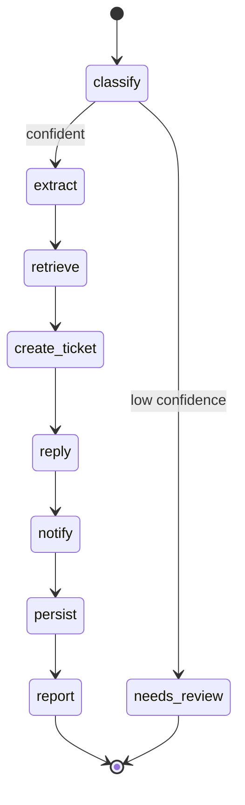

# Enterprise AI Operations Agent


An AI system that turns inbound operational work — emails, support tickets, Slack
messages, PDFs, invoices, meeting notes — into finished actions: it classifies the
request, extracts the details, grounds itself in company knowledge, opens a Jira
ticket, drafts and sends a customer reply, notifies the team on Slack, records
everything in PostgreSQL, and produces a manager-facing report. The orchestration
is an explicit, testable **LangGraph** state machine; the API is **FastAPI** with
JWT auth; long work runs asynchronously through a **Redis** queue and an idempotent
worker.

It is built to run for real: `git clone && docker compose up` gives you a working
pipeline with **no external accounts and no secrets**, because every integration
has a sandbox implementation and the LLM defaults to local Ollama.

---

## Why this design

- **Ports & adapters (hexagonal).** Every external system (LLM, Jira, Slack, email,
  vector store) sits behind a `typing.Protocol`. Each has a real adapter *and* a
  sandbox adapter, chosen per-integration by an env flag. You can wire one real
  integration at a time and keep the rest sandboxed. See
  [ADR-0002](docs/adr/0002-hexagonal-ports-and-adapters.md).
- **Explicit LangGraph state machine.** The pipeline is a fixed graph of pure
  functions, not a free-form agent loop — which makes it inspectable, unit-testable
  node-by-node, and diagrammable. Low-confidence classifications are routed to human
  review instead of taking irreversible actions. See
  [ADR-0003](docs/adr/0003-langgraph-orchestration.md).
- **Async, reliable, idempotent.** Intake returns `202` immediately; a worker
  drains a Redis queue using an at-least-once reliable-queue pattern (claim →
  process → ack, with a reaper that redelivers jobs from crashed workers and a
  dead-letter queue for poison messages). Every side-effecting call carries a
  deterministic idempotency key, so redelivery never double-creates a ticket,
  email, or Slack post. See
  [ADR-0004](docs/adr/0004-async-job-processing-redis.md) and
  [ADR-0008](docs/adr/0008-reliable-queue-and-observability.md).

Full decision log: [`docs/adr/`](docs/adr/).

## Architecture

```mermaid
flowchart LR
    c1[Ops tooling / webhooks] -->|JWT| api[FastAPI API]
    api -->|validate + enqueue| redis[(Redis queue)]
    api --> pg[(PostgreSQL)]
    worker[Worker process] -->|BLPOP| redis
    worker --> graph[LangGraph pipeline]
    worker --> pg
    graph --> llm[[LLM port]]
    graph --> know[[Knowledge port]]
    graph --> jira[[Ticket port]]
    graph --> mail[[Email port]]
    graph --> slack[[Notifier port]]
    llm -.real.-> ollama[Ollama / OpenAI-compatible]
    know -.real.-> qdrant[(Qdrant)]
    slack -.real.-> shook[Slack Incoming Webhook]
    jira -.sandbox/real.-> jsvc[Jira REST v3]
    mail -.sandbox/real.-> smtp[SMTP]
```

## Agent graph



Each node is a pure `async (AgentState, NodeContext) -> dict` function returning
only the fields it changed. Details in [`docs/architecture.md`](docs/architecture.md).

## Quickstart (local, no secrets)

Requires Docker. The default profile runs Postgres, Redis, Qdrant, the API, and the
worker with every integration in sandbox mode.

```bash
cp .env.example .env                     # 1. defaults are sandbox-safe
docker compose up --build                # 2. starts the whole stack + migrations
# 3. mint a dev token
docker compose exec api python -m scripts.create_token
# 4. submit a request (paste the token below)
curl -s -X POST localhost:8000/v1/requests?inline=true \
  -H "Authorization: Bearer $TOKEN" -H "Content-Type: application/json" \
  -d '{"channel":"email","subject":"Refund","body":"I need a refund for my invoice urgently. from Jane Smith jane@acme.com"}'
```

You'll get back a request id; fetch the outcome and artifacts:

```bash
curl -s localhost:8000/v1/requests/$ID -H "Authorization: Bearer $TOKEN"
curl -s localhost:8000/v1/requests/$ID/report -H "Authorization: Bearer $TOKEN"
```

### Without Docker

```bash
uv venv --python 3.12 && uv pip install -e ".[dev]"   # or: pip install -e ".[dev]"
make migrate         # apply schema (needs Postgres; or point POSTGRES_DSN at sqlite for a quick spin)
make api             # terminal 1
make worker          # terminal 2
```

## Turning on real integrations

Everything is one env flag at a time (see `.env.example`). Nothing else changes —
the adapters and their contract tests are identical.

| Integration | Flag | What it needs |
|-------------|------|---------------|
| LLM (real, local) | `LLM_MODE=real` | Ollama running; `ollama pull llama3.1 && ollama pull nomic-embed-text` |
| Knowledge (real)  | `KNOWLEDGE_MODE=real` | Qdrant (in compose) + a real LLM for embeddings; `make seed` |
| Slack (real, end-to-end) | `SLACK_MODE=real` | `SLACK_WEBHOOK_URL` from a Slack Incoming Webhook |
| Jira (real) | `JIRA_MODE=real` | `JIRA_BASE_URL`, `JIRA_EMAIL`, `JIRA_API_TOKEN`, `JIRA_PROJECT_KEY` |
| Email (real) | `EMAIL_MODE=real` | `SMTP_HOST`/`SMTP_PORT`/credentials |

The shipped default is sandbox for every integration, so the stack runs with no
secrets or model downloads. The real adapters are fully implemented and unit-tested
(HTTP/SMTP/Qdrant paths driven by in-memory transports); flipping a single `*_MODE`
switches to them. Slack (Incoming Webhook) and the local Ollama LLM are the
designated real end-to-end integrations. See
[ADR-0005](docs/adr/0005-real-vs-sandbox-integrations.md).

## API

| Method & path | Auth | Purpose |
|---------------|------|---------|
| `GET /health` | public | Liveness + DB/Redis readiness |
| `GET /metrics` | public | Prometheus metrics (HTTP, jobs, queue depth, dead-letters) |
| `POST /v1/auth/token` | service creds | Exchange credentials for a JWT |
| `POST /v1/requests` | `requests:write` | Submit a request (`?inline=true` runs it synchronously) |
| `GET /v1/requests/{id}` | any valid token | Status + artifacts |
| `GET /v1/requests/{id}/report` | `reports:read` | Manager report |

Interactive docs at `/docs`.

## Testing

The suite is fully hermetic — SQLite stands in for Postgres, fakeredis for Redis,
and every integration runs in sandbox mode. No services, no secrets.

```bash
make test         # run everything
make cov          # with the >80% coverage gate
make lint type    # ruff + mypy
```

## Deployment (Fly.io)

The image runs both processes; Fly's `[processes]` maps `app` to the API and
`worker` to the queue consumer.

```bash
fly launch --no-deploy                 # once, to create the app
fly postgres create && fly postgres attach <db>
fly redis create                       # sets REDIS_URL
fly secrets set JWT_SECRET=$(python -c "import secrets;print(secrets.token_urlsafe(48))") \
                SERVICE_ACCOUNT_PASSWORD=... LLM_MODE=real LLM_BASE_URL=... LLM_API_KEY=...
fly deploy
```

Details and the process model live in [`fly.toml`](fly.toml).

## Project layout

```
app/
  adapters/   ports + real/sandbox implementations (llm, knowledge, jira, slack, email)
  graph/      LangGraph nodes, retry, context, build
  jobs/       Redis queue + idempotent worker
  db/         async SQLAlchemy engine, models, repository
  security/   JWT, scopes, rate limiting
  api/        FastAPI routes + schemas
docs/adr/     architecture decision records
migrations/   Alembic
tests/        unit + integration (hermetic)
```

## Observability & security

- Structured JSON logs with a correlation id propagated across the request/worker
  boundary (`X-Request-ID`).
- `/health` reports real dependency readiness; `/metrics` exposes Prometheus
  counters/histograms/gauges (request rate + latency, job throughput by status,
  reaper redeliveries, dead-letter count, live queue depths); optional Sentry hook
  via `SENTRY_DSN`.
- JWT (HS256) with coarse scopes, Redis fixed-window rate limiting, strict boundary
  validation + control-character sanitization, request body-size limits (413) and
  baseline security headers, fail-fast production config validation, env-only
  secrets, locked CORS, pinned dependencies. See
  [ADR-0006](docs/adr/0006-security-authn-authz.md).

## Demo

Submitting a billing request and reading back the completed run (sandbox mode):

```jsonc
// POST /v1/requests?inline=true
{ "channel": "email",
  "body": "I need a refund for my invoice urgently. from Jane Smith jane@acme.com" }

// GET /v1/requests/{id}  ->  200
{
  "id": "b1f0...", "status": "completed",
  "request_type": "billing", "priority": "urgent", "confidence": 0.92,
  "artifacts": [
    { "kind": "ticket",       "ref": "OPS-1", "payload": { "url": "https://.../browse/OPS-1" } },
    { "kind": "reply",        "ref": "<...@ops-agent>", "payload": { "sent": true } },
    { "kind": "notification", "ref": "",      "payload": { "sent": true } },
    { "kind": "report",       "ref": "",      "payload": { "report": "Operations Summary ..." } }
  ]
}
```

A message with no actionable intent (low classification confidence) short-circuits
to `needs_review` and takes **no** irreversible action — no ticket, reply, or Slack
post — which you can see reflected in the returned `status` and artifacts.

## What I'd do next

- **RS256 + JWKS** so third parties can verify tokens without the shared secret.
- **Durable graph checkpointer** (LangGraph Postgres saver) for true mid-graph
  resumption instead of idempotent re-drive.
- **Outbox pattern** for external effects to make exactly-once auditable end-to-end.
- **PDF/invoice ingestion adapters** (the channels are modeled; parsing is stubbed
  to text today).
- **Per-tenant isolation and quotas**; richer authorization than coarse scopes.
- **Evaluation harness** for classification/extraction quality against a labeled set.
