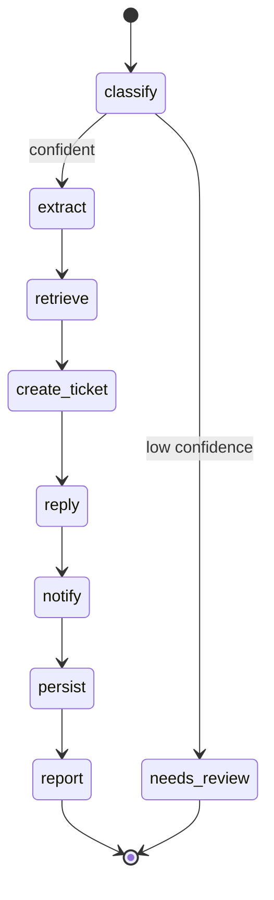

# Enterprise AI Operations Agent


> Badges are self-reported from the local suite (`make cov`), not a hosted CI
> service — the numbers are reproducible by running it.

An AI system that turns inbound operational work — emails, support tickets, Slack
messages, PDFs, invoices, meeting notes — into finished actions: it classifies the
request, extracts the details, grounds itself in company knowledge, opens a Jira
ticket, drafts and sends a customer reply, notifies the team on Slack, records
everything in PostgreSQL, and produces a manager-facing report. The orchestration
is an explicit, testable **LangGraph** state machine; the API is **FastAPI** with
JWT auth; long work runs asynchronously through a **Redis** queue and an idempotent
worker.

It is built to run for real: `git clone && docker compose up` gives you a working
pipeline with **no external accounts and no secrets**, because every integration
has a sandbox implementation and the LLM defaults to local Ollama.

---

## Project status — what's real, what isn't

An honest frame, because it's the thing most portfolio READMEs get wrong
([ADR-0020](docs/adr/0020-honest-documentation.md)):

- **Real and runnable in this repo:** the full pipeline, all adapters (real +
  sandbox), the reliable queue with crash recovery and dead-letter, cost accounting
  and the budget circuit breaker, output guardrails, the idempotency proof, JWT auth
  and the SSRF egress guard, the test suite (159 passing, 86% coverage), the eval
  harness, and the metrics endpoint. You can verify every one of these by running it.
- **Built but unverified at scale:** this has **never been deployed to production or
  run at real traffic.** The Grafana dashboard is a correct definition whose panels
  are empty until something scrapes a live instance; OpenTelemetry tracing is wired
  but not exercised against a real collector; capacity numbers need a deployed
  environment. These are labeled as such wherever they appear.
- **Costs are published provider rates**, not a measured bill — there is no real LLM
  spend to report because there's been no real deployment.

There are no invented metrics, incidents, or screenshots anywhere in these docs. If
a number isn't reproducible from this repo, it says so.

---

## Why this design

- **Ports & adapters (hexagonal).** Every external system (LLM, Jira, Slack, email,
  vector store) sits behind a `typing.Protocol`. Each has a real adapter *and* a
  sandbox adapter, chosen per-integration by an env flag. You can wire one real
  integration at a time and keep the rest sandboxed. See
  [ADR-0002](docs/adr/0002-hexagonal-ports-and-adapters.md).
- **Explicit LangGraph state machine.** The pipeline is a fixed graph of pure
  functions, not a free-form agent loop — which makes it inspectable, unit-testable
  node-by-node, and diagrammable. Low-confidence classifications are routed to human
  review instead of taking irreversible actions. See
  [ADR-0003](docs/adr/0003-langgraph-orchestration.md).
- **Async, reliable, idempotent.** Intake returns `202` immediately; a worker
  drains a Redis queue using an at-least-once reliable-queue pattern (claim →
  process → ack, with a reaper that redelivers jobs from crashed workers and a
  dead-letter queue for poison messages). Every side-effecting call carries a
  deterministic idempotency key, so redelivery never double-creates a ticket,
  email, or Slack post. See
  [ADR-0004](docs/adr/0004-async-job-processing-redis.md) and
  [ADR-0008](docs/adr/0008-reliable-queue-and-observability.md).

### The concerns that separate a demo from a system

Each of these is a real mechanism with a test and an ADR, not a checkbox:

- **Cost accounting + budget circuit breaker.** Every LLM call is priced (published
  rates) into a request-scoped ledger and persisted; a daily cap forces the sandbox
  model before a runaway bill happens, a provider-failover chain ends in sandbox so
  a provider outage degrades instead of failing. [ADR-0016](docs/adr/0016-cost-tracking.md)
- **Idempotency, proven.** A test replays one request 10× and asserts exactly one
  ticket / email / Slack post; a CI check fails the build if any external key stops
  being a pure function of `request_id`. [ADR-0017](docs/adr/0017-idempotency-strategy.md)
- **Output guardrails.** The one LLM output that reaches a customer — the emailed
  reply — passes a deterministic gate (length, foreign-address leak, prompt-echo)
  before it sends; a held reply waits for a human. [ADR-0018](docs/adr/0018-output-guardrails.md)
- **Observability.** Golden-signal + cost/guardrail metrics, a bundled Grafana
  dashboard, and opt-in OpenTelemetry tracing. [ADR-0019](docs/adr/0019-observability.md) ·
  [OBSERVABILITY.md](docs/OBSERVABILITY.md)
- **SSRF egress guard.** The caller-supplied `callback_url` can't be pointed at the
  private network or the cloud-metadata endpoint. [ADR-0021](docs/adr/0021-ssrf-egress-guard.md) ·
  [SECURITY.md](docs/SECURITY.md)

Operating it: [OPERATIONS.md](docs/OPERATIONS.md) (runbook) ·
[TROUBLESHOOTING.md](docs/TROUBLESHOOTING.md). Full decision log:
[`docs/adr/`](docs/adr/).

## Architecture

```mermaid
flowchart LR
    c1[Ops tooling / webhooks] -->|JWT| api[FastAPI API]
    api -->|validate + enqueue| redis[(Redis queue)]
    api --> pg[(PostgreSQL)]
    worker[Worker process] -->|BLPOP| redis
    worker --> graph[LangGraph pipeline]
    worker --> pg
    graph --> llm[[LLM port]]
    graph --> know[[Knowledge port]]
    graph --> jira[[Ticket port]]
    graph --> mail[[Email port]]
    graph --> slack[[Notifier port]]
    llm -.real.-> ollama[Ollama / OpenAI-compatible]
    know -.real.-> qdrant[(Qdrant)]
    slack -.real.-> shook[Slack Incoming Webhook]
    jira -.sandbox/real.-> jsvc[Jira REST v3]
    mail -.sandbox/real.-> smtp[SMTP]
```

## Agent graph



Each node is a pure `async (AgentState, NodeContext) -> dict` function returning
only the fields it changed. Details in [`docs/architecture.md`](docs/architecture.md).

## Quickstart (local, no secrets)

Requires Docker. The default profile runs Postgres, Redis, Qdrant, the API, and the
worker with every integration in sandbox mode.

```bash
cp .env.example .env                     # 1. defaults are sandbox-safe
docker compose up --build                # 2. starts the whole stack + migrations
# 3. mint a dev token
docker compose exec api python -m scripts.create_token
# 4. submit a request (paste the token below)
curl -s -X POST localhost:8000/v1/requests?inline=true \
  -H "Authorization: Bearer $TOKEN" -H "Content-Type: application/json" \
  -d '{"channel":"email","subject":"Refund","body":"I need a refund for my invoice urgently. from Jane Smith jane@acme.com"}'
```

You'll get back a request id; fetch the outcome and artifacts:

```bash
curl -s localhost:8000/v1/requests/$ID -H "Authorization: Bearer $TOKEN"
curl -s localhost:8000/v1/requests/$ID/report -H "Authorization: Bearer $TOKEN"
```

### Without Docker

```bash
uv venv --python 3.12 && uv pip install -e ".[dev]"   # or: pip install -e ".[dev]"
make migrate         # apply schema (needs Postgres; or point POSTGRES_DSN at sqlite for a quick spin)
make api             # terminal 1
make worker          # terminal 2
```

## Turning on real integrations

Everything is one env flag at a time (see `.env.example`). Nothing else changes —
the adapters and their contract tests are identical.

| Integration | Flag | What it needs |
|-------------|------|---------------|
| LLM (real, local) | `LLM_MODE=real` | Ollama running; `ollama pull llama3.1 && ollama pull nomic-embed-text` |
| Knowledge (real)  | `KNOWLEDGE_MODE=real` | Qdrant (in compose) + a real LLM for embeddings; `make seed` |
| Slack (real, end-to-end) | `SLACK_MODE=real` | `SLACK_WEBHOOK_URL` from a Slack Incoming Webhook |
| Jira (real) | `JIRA_MODE=real` | `JIRA_BASE_URL`, `JIRA_EMAIL`, `JIRA_API_TOKEN`, `JIRA_PROJECT_KEY` |
| Email (real) | `EMAIL_MODE=real` | `SMTP_HOST`/`SMTP_PORT`/credentials |

The shipped default is sandbox for every integration, so the stack runs with no
secrets or model downloads. The real adapters are fully implemented and unit-tested
(HTTP/SMTP/Qdrant paths driven by in-memory transports); flipping a single `*_MODE`
switches to them. Slack (Incoming Webhook) and the local Ollama LLM are the
designated real end-to-end integrations. See
[ADR-0005](docs/adr/0005-real-vs-sandbox-integrations.md).

## API

| Method & path | Auth | Purpose |
|---------------|------|---------|
| `GET /` | public | **Ops Command Center** — dark, glassmorphic single-page UI (Tailwind) that authenticates, submits, and visualizes the pipeline live |
| `GET /health` | public | Liveness + DB/Redis readiness |
| `GET /metrics` | public | Prometheus metrics (HTTP, jobs, queue depth, dead-letters, LLM cost, guardrail holds) |
| `GET /metrics/costs` | `reports:read` | LLM spend broken down by model / day / request type |
| `POST /v1/auth/token` | service creds | Exchange credentials for a JWT |
| `POST /v1/requests` | `requests:write` | Submit a request. `?inline=true` runs it synchronously; add `&stream=true` to stream per-node progress as **SSE** |
| `POST /v1/requests/batch` | `requests:write` | Submit up to 50 requests at once; returns the accepted ids |
| `POST /v1/requests/{id}/retry` | `requests:write` | Re-queue a failed request once its cause is fixed (safe: idempotent re-drive) |
| `GET /v1/requests` | any valid token | Paginated list of recent requests (`?limit=&offset=`) |
| `GET /v1/requests/{id}` | any valid token | Status + artifacts |
| `GET /v1/requests/{id}/report` | `reports:read` | Manager report |
| `GET /system/queue` | `reports:read` | Queue insights: `{pending, processing, dead_letter, stuck}` |
| `POST /system/queue/replay/{id}` | `requests:write` | Requeue a dead-lettered job back to pending |

Requests may include an optional `callback_url` (http/https); the worker POSTs the
final status there on completion or failure. Interactive docs at `/docs`.

**Live streaming (SSE):**

```bash
curl -N -X POST "localhost:8000/v1/requests?inline=true&stream=true" \
  -H "Authorization: Bearer $TOKEN" -H 'Content-Type: application/json' \
  -d '{"channel":"slack","body":"Production is down, outage across all regions."}'
# event: node_start / node_delta per node, then event: complete
```

## Testing

The suite is fully hermetic — SQLite stands in for Postgres, fakeredis for Redis,
and every integration runs in sandbox mode. No services, no secrets.

```bash
make test         # run everything
make cov          # with the >80% coverage gate
make lint type    # ruff + mypy
```

## Evaluation & quality gates

Model quality is measured, not assumed. A labeled golden dataset
([`evals/dataset.py`](evals/dataset.py)) is run through the *production* classify
and extract nodes; the harness reports accuracy, macro-F1 (per-class
precision/recall), extraction accuracy, and confidence calibration. The **same
harness** scores the deterministic sandbox model or a real one — swap with
`LLM_MODE`.

```bash
make eval          # sandbox model, fails under 90% accuracy AND <100% guardrail catch
LLM_MODE=real python -m evals --json report.json   # score a live model
make smoke         # live LLM smoke test (needs Ollama; self-skips otherwise)
```

Every report is **stamped with the model** that produced it, so numbers are
attributable. The harness also scores an adversarial **guardrail** corpus and gates
on the catch rate.

**Read the sandbox number honestly:** on the deterministic sandbox model the
classifier scores ~100% on the 24-case golden set — but that's a measure of the
*graph wiring*, not of any model's judgment. The sandbox is keyword-deterministic
by design ([ADR-0011](docs/adr/0011-deterministic-sandbox-model.md)); its job is to
catch regressions in the pipeline, and it says nothing about how GPT-4o would do.
Real-model accuracy is a separate, hardware-gated exercise this machine couldn't
run (documented, not faked). What the sandbox eval *does* prove: the graph parses,
routes, and calibrates confidence (0.9+ on matches, 0.35 on unknowns — which is
what justifies the `needs_review` threshold), and the guardrail catches 5/5 known-bad
drafts. See [ADR-0009](docs/adr/0009-evaluation-and-quality-gates.md).

## Performance & capacity

`make bench` runs an in-process harness (sandbox model, SQLite, fakeredis) that
isolates the overhead *our code* adds. Honest headline: orchestration overhead is
**~20–35 ms p50 (warm)** per 8-node pipeline with **~6 KiB** transient memory per
run; end-to-end latency in production is **dominated by the LLM call** (0.5–3 s).

The design makes capacity easy to reason about: ingest is non-blocking (validate +
insert + enqueue), processing is LLM-bound at `~1/L` jobs/s per worker, and the
reliable queue decouples them so throughput is **`N/L`** — tuned by worker count.
Representative load numbers require a deployed environment (Postgres + Redis + a
real model); the harness, methodology, capacity model, and the exact steps to get
real numbers are in [`docs/BENCHMARKS.md`](docs/BENCHMARKS.md). `/metrics` already
exposes job latency, throughput, and queue depth for that measurement.

## Deployment (Fly.io)

The image runs both processes; Fly's `[processes]` maps `app` to the API and
`worker` to the queue consumer.

```bash
fly launch --no-deploy                 # once, to create the app
fly postgres create && fly postgres attach <db>
fly redis create                       # sets REDIS_URL
fly secrets set JWT_SECRET=$(python -c "import secrets;print(secrets.token_urlsafe(48))") \
                SERVICE_ACCOUNT_PASSWORD=... LLM_MODE=real LLM_BASE_URL=... LLM_API_KEY=...
fly deploy
```

Details and the process model live in [`fly.toml`](fly.toml).

## Project layout

```
app/
  adapters/   ports + real/sandbox implementations (llm, knowledge, jira, slack, email)
  graph/      LangGraph nodes, retry, context, build
  jobs/       Redis queue + idempotent worker
  db/         async SQLAlchemy engine, models, repository
  security/   JWT, scopes, rate limiting, SSRF egress guard
  api/        FastAPI routes + schemas
  cost.py     per-request LLM cost ledger    guardrails.py  output guardrail
  tracing.py  opt-in OpenTelemetry
docs/adr/     architecture decision records (0001-0021)
docs/         OPERATIONS · TROUBLESHOOTING · SECURITY · OBSERVABILITY · BENCHMARKS
ops/          Prometheus config + Grafana dashboard/provisioning
migrations/   Alembic
evals/        labeled dataset + guardrail corpus + evaluation harness + metrics
scripts/      create_token · seed_knowledge · benchmark · idempotency_check
tests/        unit + integration (hermetic) + smoke (live, self-skipping)
```

## Observability & security

- Structured JSON logs with a correlation id propagated across the request/worker
  boundary (`X-Request-ID`).
- `/health` reports real dependency readiness; `/metrics` exposes Prometheus
  counters/histograms/gauges (request rate + latency, job throughput by status,
  reaper redeliveries, dead-letter count, live queue depths, **LLM spend by model**,
  **guardrail holds**). A bundled Grafana dashboard (`ops/grafana/`) renders them;
  bring the stack up with `docker compose --profile observability up`. Optional
  Sentry (`SENTRY_DSN`) and opt-in OpenTelemetry tracing (`OTEL_EXPORTER_OTLP_ENDPOINT`).
  Full guide: [OBSERVABILITY.md](docs/OBSERVABILITY.md).
- JWT (HS256) with coarse scopes, Redis fixed-window rate limiting, strict boundary
  validation + control-character sanitization, an **SSRF egress guard** on
  `callback_url`, request body-size limits (413) and baseline security headers,
  fail-fast production config validation, env-only secrets, locked CORS, pinned
  dependencies. Threat model and honest limitations: [SECURITY.md](docs/SECURITY.md).
  See [ADR-0006](docs/adr/0006-security-authn-authz.md).

## Demo

A self-contained web UI is served at **`/`** (open `http://localhost:8000/`): log
in with the dev service account, submit a message, and watch the live pipeline
light up node-by-node with the classification, ticket, drafted reply, and report.
It's a thin demonstration surface over the API — no build step, no framework.

Or via the API directly — submitting a billing request and reading back the
completed run (sandbox mode):

```jsonc
// POST /v1/requests?inline=true
{ "channel": "email",
  "body": "I need a refund for my invoice urgently. from Jane Smith jane@acme.com" }

// GET /v1/requests/{id}  ->  200
{
  "id": "b1f0...", "status": "completed",
  "request_type": "billing", "priority": "urgent", "confidence": 0.92,
  "artifacts": [
    { "kind": "ticket",       "ref": "OPS-1", "payload": { "url": "https://.../browse/OPS-1" } },
    { "kind": "reply",        "ref": "<...@ops-agent>", "payload": { "sent": true } },
    { "kind": "notification", "ref": "",      "payload": { "sent": true } },
    { "kind": "report",       "ref": "",      "payload": { "report": "Operations Summary ..." } }
  ]
}
```

A message with no actionable intent (low classification confidence) short-circuits
to `needs_review` and takes **no** irreversible action — no ticket, reply, or Slack
post — which you can see reflected in the returned `status` and artifacts.

## What I'd do next

- **Deploy it and get real numbers** — the honest #1: run it under traffic so the
  dashboard, tracing, and capacity model move from "wired" to "measured."
- **RS256 + JWKS** so third parties can verify tokens without the shared secret.
- **Durable graph checkpointer** (LangGraph Postgres saver) for true mid-graph
  resumption instead of idempotent re-drive.
- **Outbox pattern** for external effects to make exactly-once auditable end-to-end.
- **Shared-store rate limiting** (currently per-instance) and **`pip-audit`/Dependabot**
  in CI — the security gaps SECURITY.md lists.
- **Pin the SSRF connection to the vetted IP** to close the residual DNS-rebinding
  window ([ADR-0021](docs/adr/0021-ssrf-egress-guard.md)).
- **PDF/invoice ingestion adapters** (the channels are modeled; parsing is stubbed
  to text today).
- **Grow the eval set** and add inter-annotator review; track quality over time in CI.
