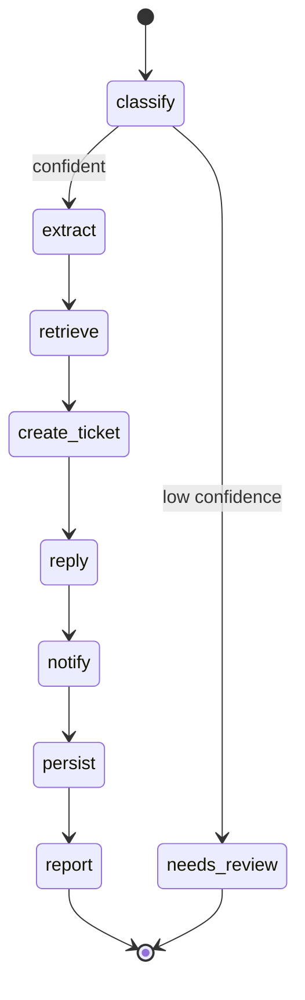
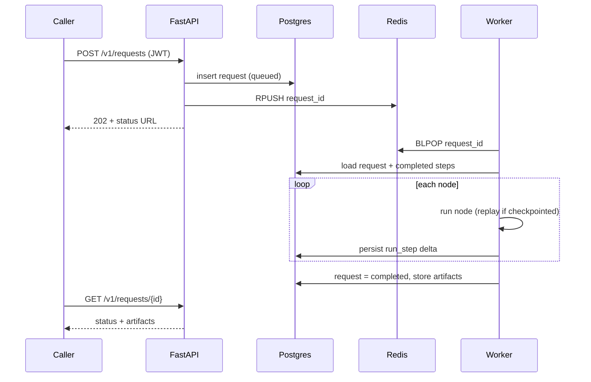

# Architecture

Enterprise AI Operations Agent — a service that ingests inbound work (emails,
support tickets, Slack messages, PDFs, invoices, meeting notes), runs a fixed
LangGraph pipeline to understand and action it, and produces auditable outcomes:
a Jira ticket, a customer reply, a Slack notification, a durable record, and a
manager report.

This document is the implementation contract. The directory tree below is built
exactly as specified. Rationale lives in [ADRs](adr/).

## System context

```mermaid
flowchart LR
    subgraph client [Callers]
      c1[Ops tooling / webhooks]
    end

    c1 -->|JWT| api[FastAPI API]

    api -->|validate + enqueue| redis[(Redis queue)]
    api --> pg[(PostgreSQL)]

    worker[Worker process] -->|BLPOP| redis
    worker --> graph[LangGraph pipeline]
    worker --> pg

    graph --> llm[[LLM port]]
    graph --> know[[Knowledge port]]
    graph --> jira[[Ticket port]]
    graph --> mail[[Email port]]
    graph --> slack[[Notifier port]]

    llm -.real.-> ollama[Ollama / OpenAI-compatible]
    know -.real.-> qdrant[(Qdrant)]
    slack -.real.-> shook[Slack Incoming Webhook]
    jira -.sandbox/real.-> jsvc[Jira REST v3]
    mail -.sandbox/real.-> smtp[SMTP]
```

Ports (`[[...]]`) are `typing.Protocol` seams. Each resolves to a real or sandbox
adapter via `*_MODE` env flags — see [ADR-0002](adr/0002-hexagonal-ports-and-adapters.md)
and [ADR-0005](adr/0005-real-vs-sandbox-integrations.md).

## Agent graph

Linear core flow with one conditional guard: a low-confidence classification is
routed to `needs_review` instead of taking irreversible actions.



Each node is a pure function `(AgentState, NodeContext) -> dict` returning only
its delta. Nodes are checkpointed to the `run_step` table for idempotent replay —
see [ADR-0004](adr/0004-async-job-processing-redis.md).

## Request lifecycle



## Directory tree

```text
enterprise-ai-ops-agent/
├── README.md
├── pyproject.toml                # deps (pinned), tool config: ruff, mypy, pytest
├── Makefile                      # dev shortcuts: install, lint, type, test, up
├── .env.example                  # every env var, documented, safe placeholders
├── .gitignore
├── .dockerignore
├── Dockerfile                    # single image, api/worker via entrypoint arg
├── docker-compose.yml            # api, worker, postgres, redis, qdrant, ollama
├── fly.toml                      # deploy target (Fly.io)
├── alembic.ini
├── docs/
│   ├── architecture.md           # this file
│   └── adr/
│       ├── 0001-record-architecture-decisions.md
│       ├── 0002-hexagonal-ports-and-adapters.md
│       ├── 0003-langgraph-orchestration.md
│       ├── 0004-async-job-processing-redis.md
│       ├── 0005-real-vs-sandbox-integrations.md
│       ├── 0006-security-authn-authz.md
│       └── 0007-persistence-postgres-qdrant.md
├── migrations/                   # alembic
│   ├── env.py
│   ├── script.py.mako
│   └── versions/
│       └── 0001_initial_schema.py
├── scripts/
│   ├── create_token.py           # operator JWT minting CLI
│   └── seed_knowledge.py         # load seed corpus into Qdrant
├── app/
│   ├── __init__.py
│   ├── main.py                   # FastAPI app factory + middleware wiring
│   ├── config.py                 # pydantic-settings Settings
│   ├── logging.py                # structured JSON logging setup
│   ├── observability.py          # request-id + metrics middleware, security headers
│   ├── metrics.py                # Prometheus metric definitions
│   ├── deps.py                   # composition root: build ports from Settings
│   ├── errors.py                 # base typed exceptions + API error handlers
│   ├── domain/
│   │   ├── __init__.py
│   │   ├── enums.py              # RequestType, Channel, Priority, RunStatus
│   │   └── state.py             # AgentState, artifacts (Pydantic)
│   ├── adapters/
│   │   ├── __init__.py
│   │   ├── base.py              # Port Protocols + AdapterError hierarchy
│   │   ├── llm/
│   │   │   ├── __init__.py
│   │   │   ├── openai_compatible.py   # REAL (Ollama/OpenAI-compatible)
│   │   │   └── sandbox.py
│   │   ├── knowledge/
│   │   │   ├── __init__.py
│   │   │   ├── qdrant_store.py        # REAL
│   │   │   └── sandbox.py
│   │   ├── jira/
│   │   │   ├── __init__.py
│   │   │   ├── rest.py                # REAL adapter
│   │   │   └── sandbox.py
│   │   ├── slack/
│   │   │   ├── __init__.py
│   │   │   ├── webhook.py             # REAL (designated end-to-end)
│   │   │   └── sandbox.py
│   │   └── email/
│   │       ├── __init__.py
│   │       ├── smtp.py                # REAL adapter
│   │       └── sandbox.py
│   ├── graph/
│   │   ├── __init__.py
│   │   ├── context.py           # NodeContext (injected deps)
│   │   ├── retry.py             # async retry-with-backoff decorator
│   │   ├── nodes.py             # pure node functions
│   │   └── build.py             # assemble + compile StateGraph; runner
│   ├── jobs/
│   │   ├── __init__.py
│   │   ├── queue.py             # Redis enqueue/dequeue
│   │   └── worker.py           # worker loop + checkpoint replay
│   ├── db/
│   │   ├── __init__.py
│   │   ├── engine.py            # async engine + session factory
│   │   ├── models.py           # SQLAlchemy 2.0 typed models
│   │   └── repository.py        # data access (no raw SQL in nodes)
│   ├── security/
│   │   ├── __init__.py
│   │   ├── jwt.py              # mint/verify HS256
│   │   ├── auth.py             # FastAPI auth deps + scopes
│   │   └── rate_limit.py       # Redis fixed-window limiter
│   └── api/
│       ├── __init__.py
│       ├── schemas.py          # request/response Pydantic models
│       ├── routes_health.py
│       ├── routes_metrics.py
│       ├── routes_auth.py
│       ├── routes_requests.py  # submit + status + report
│       └── router.py           # aggregate router
└── tests/
    ├── __init__.py
    ├── conftest.py             # fixtures: settings, sandbox ctx, client
    ├── unit/
    │   ├── __init__.py
    │   ├── test_classify_node.py
    │   ├── test_extract_node.py
    │   ├── test_retrieve_node.py
    │   ├── test_action_nodes.py
    │   ├── test_report_node.py
    │   ├── test_retry.py
    │   ├── test_jwt.py
    │   ├── test_rate_limit.py
    │   ├── test_sandbox_adapters.py
    │   └── test_state_validation.py
    └── integration/
        ├── __init__.py
        ├── test_graph_end_to_end.py
        ├── test_api_requests.py
        └── test_auth_flow.py
```

## Environments & modes

| Concern      | Local (default)              | CI                     | Deploy (Fly.io)          |
|--------------|------------------------------|------------------------|--------------------------|
| LLM          | Ollama in compose (real)     | sandbox                | OpenAI-compatible (real) |
| Slack        | sandbox (set real to enable) | sandbox                | real via webhook secret  |
| Jira / Email | sandbox                      | sandbox                | real via secrets         |
| Knowledge    | Qdrant in compose (real)     | sandbox                | Qdrant service (real)    |
| Postgres/Redis | compose                    | service containers     | managed / attached       |

CI runs the entire suite in full-sandbox mode with no secrets, so it is
hermetic and reproducible.
```
